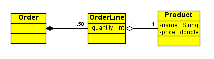
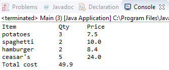

# Order Program

Υλοποιήστε το πρόγραμμα που περιγράφεται από το παρακάτω διάγραμμα.

Κάθε παραγγελία (Order) αποτελείται από σειρές παραγγελίας (orderlines). Η κάθε σειρά παραγγελίας απαρτίζεται από ένα προϊόν (Product) και την ποσότητα αυτού που έχει παραγγελθεί. 

Χρησιμοποιήστε το `OrderProgram.java`, με βάση το οποίο

- Υλοποιήστε το `class Product`
- Υλοποιήστε το `class Orderline`
- Υλοποιήστε το `class Order`
- Υλοποιήστε την μέθοδο `printReceipt()` στο κατάλληλο class, έτσι ώστε να εκτυπώνει στην κονσόλα το συνολικό κόστος της παραγγελίας. Κατά την εκτέλεση του προγράμματος, θα πρέπει να βλέπετε το εξής output:

**ΣΗΜΕΙΩΣΗ: Δεν πρέπει να αλλάξετε με κανέναν τρόπο τον κώδικα το αρχείο OrderProgram.java**
